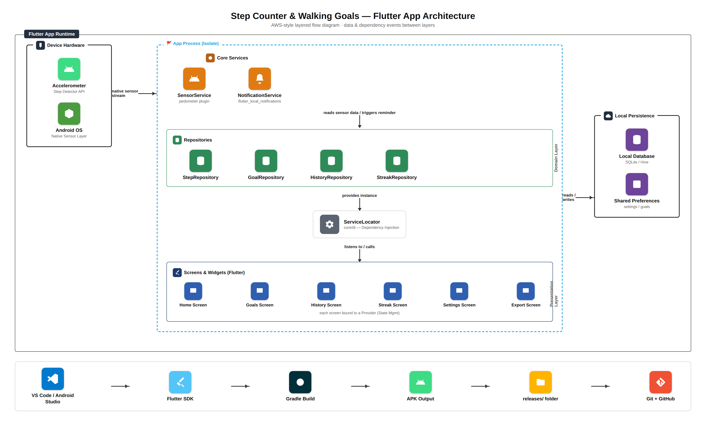
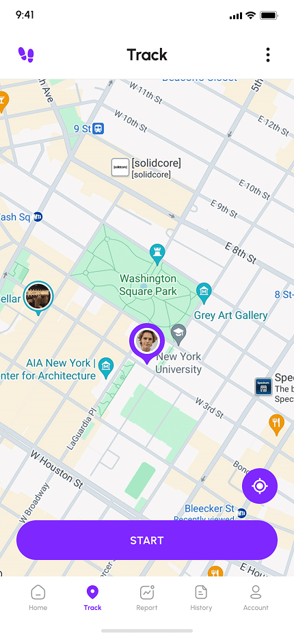

<div align="center">

# Step Counter & Walking Goals

A privacy-friendly Flutter application for Android that helps users track their daily physical activity and stay motivated toward a healthier lifestyle.

</div>

<div align="center">

### Team

|  |  |  |
| :----------------------------------------------------------------------------------------------------------------------------------------------------------: | :------------------------------------------------------------------------------------------------------------------------------------------------------: | :-------------------------------------------------------------------------------------------------------------------------------------------------------------: |
|                                                                      **Abdullah Rana**                                                                       |                                                                      **Ahmad Ali**                                                                       |                                                                      **Abdullah Qureshi**                                                                       |
|                                                                     Full Stack Engineer                                                                      |                                                                    Frontend Developer                                                                    |                                                                       Frontend Developer                                                                        |
|                                                                  `FullStack/Abdullah-Rana`                                                                   |                                                                   `FrontEnd/Ahmad-Ali`                                                                   |                                                                   `FrontEnd/Abdullah-Qureshi`                                                                   |

</div>

---

The app uses the device's built-in motion and activity sensors to automatically count steps, with no external hardware, wearables, or manual logging required.

## Overview

Step Counter & Walking Goals lets users set a personal daily step goal and visualize their progress in real time through a progress ring on the home dashboard. Alongside the live step count, the app estimates distance walked and maintains a running history of past days, giving users insight into both daily activity and long-term consistency.

To encourage habit-building, the app includes a streak system that tracks consecutive days a goal has been met, along with a weekly chart that visualizes step trends. A lightweight reminder notification nudges users who are falling behind their daily target, and an optional data export feature allows users to save or share their walking history outside the app.

The app is deliberately minimal: no user account, no sign-up, and no social features. All step data is stored locally on the user's device, making the app privacy-respecting by default while still delivering real, everyday value.

This project was built as a semester project for a Mobile Application Development course.

## Features

- Automatic step counting using native device sensors
- Custom daily step goal configuration
- Real-time progress visualization with a home dashboard progress ring
- Estimated distance walked
- Historical log of daily step counts
- Streak tracking for consecutive goal completions
- Weekly step trend chart
- Reminder notifications for users falling behind their goal
- Local data export/sharing of walking history
- Fully offline, on-device data storage with no account or sign-up required

## Tech Stack

### Core

- **Flutter** - Cross-platform UI toolkit used to build the application
- **Dart** - Programming language used throughout the app

### Platform

- **Android** - Sole target platform for this project (iOS, web, and desktop targets are excluded)
- **Kotlin** - Android platform-specific native code (`MainActivity`)
- **Gradle** - Android build system

### State Management

- **provider** - Application state handling and dependency access across features

### Planned Packages and Tools

- **Sensors package** (e.g. `sensors_plus` / `pedometer`) - Access to device accelerometer and step-detection APIs
- **Local storage** (e.g. `sqflite` / `hive` / `shared_preferences`) - On-device persistence for step history, goals, and settings
- **Charting library** (e.g. `fl_chart` / `syncfusion_flutter_charts`) - Weekly step trend visualization
- **Local notifications** (e.g. `flutter_local_notifications`) - Daily goal reminder nudges
- **File/data export** (e.g. `share_plus` / `csv`) - Exporting and sharing walking history

### Tooling

- **Flutter SDK** (^3.13.2 Dart SDK constraint)
- **flutter_lints** - Static analysis and recommended lint rules
- **Android Studio / VS Code** - Development environment
- **Git & GitHub** - Version control and source hosting

## Architecture

The application follows a layered architecture that separates UI, state management, dependency wiring, domain logic, and platform services, allowing the team to work on distinct layers in parallel without conflicts.



**Flow summary:**

1. **Presentation Layer** - Each screen (Home, Goals, History, Streak, Settings, Export) is bound to its own `Provider` for state management.
2. **Dependency Injection** - Providers resolve their dependencies through a central `ServiceLocator` (`core/di`), which constructs and exposes repository instances.
3. **Domain / Data Access Layer** - Repositories (`StepRepository`, `GoalRepository`, `HistoryRepository`, `StreakRepository`) mediate between the UI and both core services and local persistence.
4. **Core Services** - `SensorService` reads step data from the device's native sensors; `NotificationService` triggers daily goal reminders.
5. **Local Persistence** - Repositories read and write structured data (step history, streaks) to a local database (SQLite/Hive) and simple key-value data (settings, goals) to shared preferences.
6. **Device Hardware** - The Android OS exposes the accelerometer and step detector sensor APIs, streamed natively into the app process.

The bottom strip of the diagram shows the local build pipeline: development in VS Code / Android Studio, compiled via the Flutter SDK and Gradle, producing an APK that is placed in the `releases/` folder and version-controlled through Git and GitHub.

Additional and updated architecture diagrams for individual features are maintained in the [`architectures/`](architectures/) folder.

## Design

Static exports of the UI/UX designs (screens, states, and flows) are kept in the [`design/`](design/) folder for reference during frontend implementation, organized by feature: Dashboard, History, Live Tracking, On-Boardings, Settings, FAQ, and Water Reminder. These are reference snapshots only, not editable design source files.

### Screens

<div align="center">

|                                     Login                                     |                                   Sign Up                                    |                               Dashboard                               |
| :---------------------------------------------------------------------------: | :--------------------------------------------------------------------------: | :-------------------------------------------------------------------: |
|  |  |  |

|                              Water Level                               |                          Live Tracking                          |
| :--------------------------------------------------------------------: | :-------------------------------------------------------------: |
|  |  |

</div>

## Project Structure

```text
Fitness-App-Flutter/
│
├── assets/                          # Static media assets used by the app
│   ├── icons/                       # Transparent icon assets (app_logo_white, app_logo_purple)
│   └── images/                      # Screen mockups and brand artwork (footprints, TrackFit logo)
│
├── design/                          # Reference UI/UX screens from Figma (not used in code)
│   ├── DashBoard/
│   ├── On-Boardings/
│   └── ...
│
├── lib/                             # All Flutter Dart source code
│   │
│   ├── main.dart                    # App entry point (launches SplashScreen & initial routes)
│   │
│   ├── core/                        # Global resources shared across the entire app
│   │   ├── constants/               # Colors (#7F27FF), themes, and asset paths
│   │   └── di/                      # ServiceLocator (dependency wiring for services/repos)
│   │
│   └── features/                    # Modular feature directories (one folder per app feature)
│       │
│       ├── splash/                  # Splash Screen feature
│       │   └── presentation/
│       │       ├── screens/         # splash_screen.dart (the animated startup screen)
│       │       └── widgets/         # fading_spinner.dart, footprints_icon.dart
│       │
│       ├── onboarding/               # Onboarding & Welcome feature
│       │   └── presentation/
│       │       └── screens/         # welcome_screen.dart ("Let's Get Started!")
│       │
│       ├── auth/                    # Sign-in / authentication feature
│       │   ├── data/                # auth_service.dart (auth data access)
│       │   ├── domain/
│       │   │   └── models/          # user_model.dart
│       │   └── presentation/
│       │       ├── screens/         # sign_in_screen.dart
│       │       └── widgets/         # custom_text_field.dart, social_sign_in_button.dart, etc.
│       │
│       ├── home/                    # Home dashboard feature
│       │   ├── presentation/
│       │   │   ├── screens/         # home_screen.dart
│       │   │   └── widgets/         # home-specific widgets (progress ring, etc.)
│       │   └── providers/           # Home screen state management
│       │
│       ├── goals/                   # Daily step goal configuration feature (scaffolded)
│       │   ├── presentation/
│       │   │   ├── screens/
│       │   │   └── widgets/
│       │   └── providers/
│       │
│       ├── history/                 # Historical step log feature (scaffolded)
│       │   ├── presentation/
│       │   │   ├── screens/
│       │   │   └── widgets/
│       │   └── providers/
│       │
│       ├── streak/                  # Consecutive goal streak tracking feature (scaffolded)
│       │   ├── presentation/
│       │   │   ├── screens/
│       │   │   └── widgets/
│       │   └── providers/
│       │
│       ├── settings/                # App settings feature (scaffolded)
│       │   ├── presentation/
│       │   │   ├── screens/
│       │   │   └── widgets/
│       │   └── providers/
│       │
│       └── export/                  # Data export/sharing feature (scaffolded)
│           ├── presentation/
│           └── providers/
│
├── test/                            # Automated widget and unit tests
│   └── features/splash/             # splash_screen_test.dart
│
└── pubspec.yaml                     # Dependencies and registered asset paths
```

Every feature folder under `lib/features/` follows the same shape — `presentation/screens`, `presentation/widgets`, and `providers/` (plus `data/`/`domain/` where a feature owns its own data access, as in `auth/`) — so once you know one feature, you know them all. Folders marked "scaffolded" above (`goals`, `history`, `streak`, `settings`, `export`) are already created and tracked in git (via `.gitkeep`) as the intended home for upcoming feature work, keeping the target structure visible to the whole team even before the code inside them is written.

## Getting Started

### Prerequisites

- Flutter SDK (^3.13.2 or later)
- Android Studio or VS Code with the Flutter/Dart plugins
- An Android device or emulator running Android 5.0 (API 21) or higher

### Setup

1. For the Cloning of the repository:
   ```
   git clone https://github.com/Abdullah-819/Fitness-App-Flutter.git
   ```
2. Navigate into the project directory:
   ```
   cd Fitness-App-Flutter
   ```
3. Install dependencies:
   ```
   flutter pub get
   ```
4. Run the application on a connected Android device or emulator:
   ```
   flutter run
   ```

## Team Collaboration

Each team member works on a dedicated branch aligned with their role (see the Team section above). Feature folders under `lib/features/` are structured so each contributor can work independently within their own `presentation/` and `providers/` subfolders without conflicting with the data layer. See [CONTRIBUTING.md](CONTRIBUTING.md) for the full branching and commit workflow.

## Release Builds

Locally built APKs can be placed in the `releases/` folder for quick access and sharing among the team. This folder is tracked in git, but `.apk`/`.aab` files inside it are excluded from version control to keep the repository lightweight. Each team member manages their own local builds in this folder.

## Platform Scope

This application targets Android exclusively. iOS, web, Windows, macOS, and Linux platform folders are intentionally not included, as this project is not intended for cross-platform distribution.

## Privacy

All step, goal, streak, and history data is stored locally on the user's device. The application does not require an account, does not include social or networked features, and does not transmit user data to any external server.

## License

This project was developed for academic purposes as part of a Mobile Application Development course.
